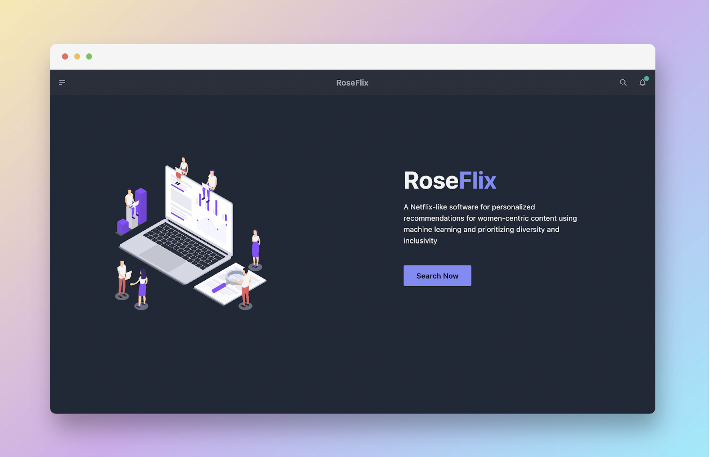
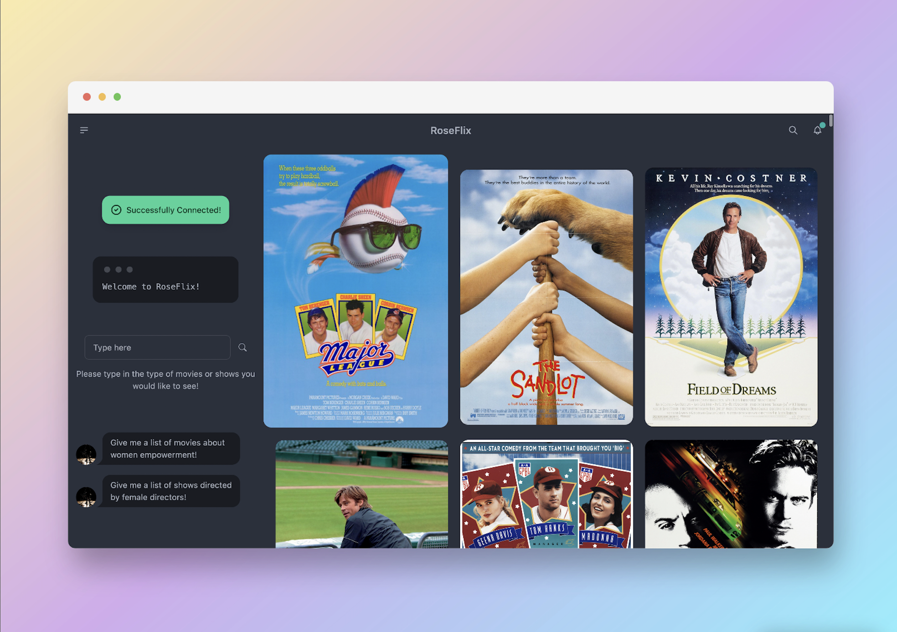

## What it does

RoseFlix is a website that helps users discover films that highlight underrepresentation in the entertainment industry. Users can search for films based on specific topics of interest, such as films directed by women or films featuring female empowerment. Once films are displayed from the search, users can click on a film of interest and watch its trailer to determine if it is a movie that interests them.

By offering a platform for users to explore films that may not have mainstream appeal, RoseFlix aims to give underrepresented voices in the film industry the opportunity to be heard.

## Final Product

<p align="center">


</p>

## Inspiration

It starts from a conversation we had with one of our members, who is an avid movie fan, particularly on Netflix. Speaking with them, sparked a realization that films most commonly recommended are either classics or made by well-known production companies. This led us to contemplate the underrepresentation in the entertainment industry, not only in terms of on-screen representation but also in terms of the hardworking individuals behind the scenes such as directors and producers.

With the abundance of film options available today, it can be challenging to find and appreciate truly exceptional movies. Many people base their film choices on the popularity of a specific actor/actress or whether a movie is currently trending. To address this issue, we aim to create a platform that highlights great films for their artistic and technical excellence, rather than just their mainstream appeal.

## How we built it

We build a NextJS app that uses Prisma ORM to interact with MongoDB. This allows for the interactions by users to be seamless and visually pleasing. One of the key proponents of the project is the use of AI, and ML topics to generate extremely custom and unique results for each user. With the help of AI tools and 3rd party APIs, we were able to display the desired results for any user-defined query.

## Challenges we ran into

MongoDB Atlas API requests would time out in addition to SSL certificate not found errors. This resulted in our team making the decision to forgo a nonessential Python feature which would’ve enriched the document data in MongoDB.

## Accomplishments that we're proud of

We are very proud of our team as a whole. The majority of our team members have never touched the following frameworks before this project - Next.js and Tailwind. We also had members that were not familiar with TypeScript either, which was a programming language we utilized a lot in this project.

Yet, despite this, we were able to work together and produce a project that successfully integrated many tools.

## What we learned

During this project, we each were able to get a better grasp on all the tools we integrated into our project. More specifically, we were able to go further in our understanding of how to implement and utilize APIs and AI.

## What's next for RoseFlix

Roseflix has exciting developments in store. One key feature we plan to implement is a search suggestion based on popular searches among users. This feature will provide users with recommendations and help them discover films they may not have known they were interested in. With this recommendation feature, we hope that users will be able to find films that suit their taste, even if they are not sure of what to search for. This is also a great way to step out of one's comfort zones and discover films by chance, expanding their movie-watching experience.
Built With

## Getting Started

First, run the development server:

```bash
npm run dev
# or
yarn dev
# or
pnpm dev
```

Open [http://localhost:3000](http://localhost:3000) with your browser to see the result.

You can start editing the page by modifying `pages/index.tsx`. The page auto-updates as you edit the file.

[API routes](https://nextjs.org/docs/api-routes/introduction) can be accessed on [http://localhost:3000/api/hello](http://localhost:3000/api/hello). This endpoint can be edited in `pages/api/hello.ts`.

The `pages/api` directory is mapped to `/api/*`. Files in this directory are treated as [API routes](https://nextjs.org/docs/api-routes/introduction) instead of React pages.

This project uses [`next/font`](https://nextjs.org/docs/basic-features/font-optimization) to automatically optimize and load Inter, a custom Google Font.

## Learn More

To learn more about Next.js, take a look at the following resources:

- [Next.js Documentation](https://nextjs.org/docs) - learn about Next.js features and API.
- [Learn Next.js](https://nextjs.org/learn) - an interactive Next.js tutorial.

You can check out [the Next.js GitHub repository](https://github.com/vercel/next.js/) - your feedback and contributions are welcome!

## Deploy on Vercel

The easiest way to deploy your Next.js app is to use the [Vercel Platform](https://vercel.com/new?utm_medium=default-template&filter=next.js&utm_source=create-next-app&utm_campaign=create-next-app-readme) from the creators of Next.js.

Check out our [Next.js deployment documentation](https://nextjs.org/docs/deployment) for more details.
